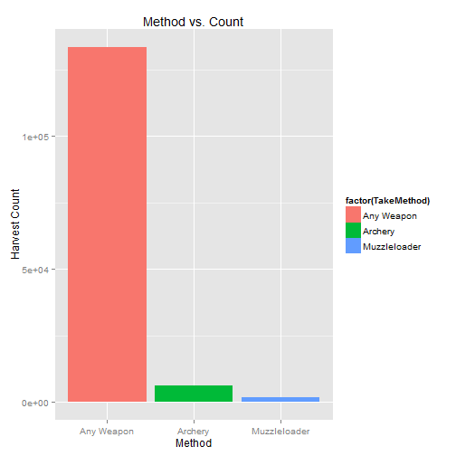

Deer Harvest Rates  
========================================================
author: IdahoGal
date: Sat Mar 21 15:57:28 2015
transition: rotate

<small>

Coursera Data Products Class  
Data Science Specialization
</small>

App Overview
========================================================

This Shiny app is used to calculate deer harvest for Idaho
Fish & Game and has the following characterisitcs:
- Uses 12 publically available data sets from Idaho Fish & Game
- Allows users to specify the Year of interest
- Is based on these variables:  Harvest numbers, Hunter numbers
- Uses RStudio Shiny for app development & deployment
- Uses RPubs for slide publication

Application Features
========================================================
The application includes the following features:  
- User selectable variable (Year)
- Based on the Year, the data set is dynamically selected
  and processed 
- Navigation lets the user tab through three separate
  outputs including success metric, data set summary,
  data plot, and top 20 data set rows
- server.R reads in and prepares 12 data sets, calculates
  the harvest metric, selects the appropriate data set based
  on the Year selection, and plots the data
 
 
Data Summary (2001 - 2013)
========================================================

 
TRY IT!
========================================================
TRY OUT THE APP Here:  https://idahogal.shinyapps.io/ClassProjShiny/

